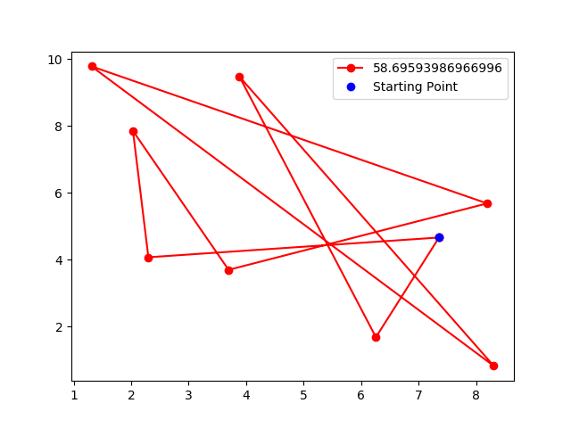
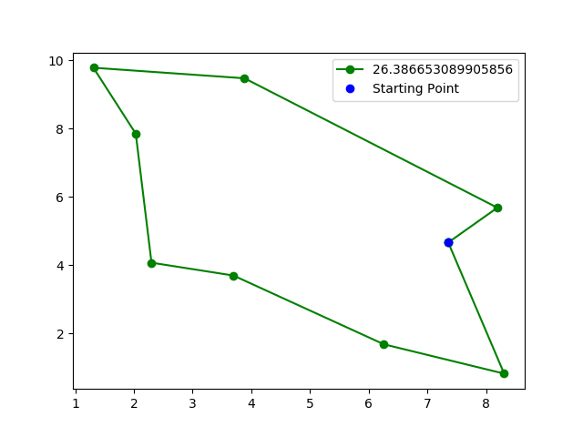
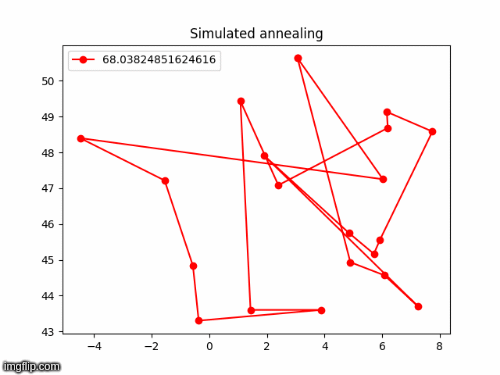

# Markov-Chain-Monte-Carlo
*Simulated Annealing for the Travelling Salesman Problem*

The Travelling Salesman Problem is a NP-hard optimization problem, asking the question : "<i>Given a list of cities with their coordinates and a starting point, what is the shortest path that visits each city and returns to the starting point?</i>".

It is theoretically possible to explore all possible path and save the best one. But in practice, the complexity of such an algorithm will explode in computing time but also in memory allocation if the number of given cities grows.

Since the trivial algorithm exploring all potential routes is not viable, many other algorithms have been developed to find at least one of the optimal solutions.

The Simulated Annealing algorithm is one of these algorithms, and will be explained here.

# Exhaustive Research

An exhaustive research is feasible only when the number <i>m</i> of points is small. But since the number of possible route configuration grows by a factorial factor while <i>m</i>  increases, it fastly becomes impossible to compute the best configuration.

How ever it is still interesting to compute such an algorithm and measure its time of execution while <i>m</i>  increases. 

First, we need to compute the whole configuration list.

There already exist plenty algorithms for listing these configurations, but it tastes always better when it is homemade! 
Even if the purpose of this report is not to explain precisely how such an algorithm works, you can still find the corresponding python code <i>exhaustive.py</i> in this repository.

  Below is a table containing some measures taken following the number of cities <i>m</i>, and two images illustrating the result of the exhaustive research algorithm.

<table align = 'center'>
<tr align = 'center'>
  <th>m</th>
  <th>Number of routes</th>
  <th>Computation time (s)</th>
  <td rowspan=10></td>
<tr>
<tr align = 'center'>
  <td>4</td>
  <td>6</td>
  <td>0.0008</td>
<tr>
<tr align = 'center'>
  <td>5</td>
  <td>24</td>
  <td>0.0042</td>
<tr>
<tr align = 'center'>
  <td>6</td>
  <td>120</td>
  <td>0.0179</td>
<tr>
<tr align = 'center'>
  <td>7</td>
  <td>720</td>
  <td>0.1433</td>
<tr>
<tr align = 'center'>
  <td>8</td>
  <td>5040</td>
  <td>1.1130</td>
  <td rowspan=8></td>
<tr>
<tr align = 'center'>
  <td>9</td>
  <td>40320</td>
  <td>10.121</td>
<tr>
<tr align = 'center'>
  <td>10</td>
  <td>362880</td>
  <td>100.69</td>
<tr>
<tr align = 'center'>
  <td>11</td>
  <td>10!</td>
  <td>/!\ MY LAPTOP CRASHED /!\</td>
<tr>
</table>

# The Simulated Annealing Algorithm

Let the initial route where  is the departure city :

  

We compute the length of a route with the following formula :

  

Where  is a function which compute the length between two cities given as parameters.

The idea of the Simulated Annealing Algorithm applied to the Traveling Salesman Algorithm is to minimize the system's energy. Such an energy is here described as the length of the current selected route. Then, in order to minimize this energy, the target is to find the shortest route.

As explained above, doing so by exploring all routes and selecting the shortest one becomes impossible. The solution here is to propose a random neighbour of our current configuration, and see if choosing it makes the system's energy decreasing.

Let call neighbours two different configurations if it is possible to reach one of them from the other by swapping two of its cities.

For example, with 4 given cities, these both configurations can be called neighbours : 

Then, from a current configuration, we can choose a random neighbour if it has smaller length than the current configuration, but if not, we can still choose it if it has a greater probability of acceptance than a random value <i>u</i> following an uniform law between 0 and 1.

This probability of acceptance is described as :

Where  is the current configuration,  its randomly selected neighbour, and <i>T</i> the temperature of the system.

The temperature <i>T</i> has its whole importance here. Indeed, higher the temperature is, closer to 1 will be the probability of acceptance, In opposite lower the temperature is, closer to 0 will be the probability of acceptance. Furthermore, bigger is the gap between  and , lower will be the probability of acceptance.

Such a mechanism avoids getting stuck in a local optimum, permitting to move to a neighbour even if it makes the global energy increase. However, too big temperature causes the probability of acceptance stuck at 1. The proposed configurations will always be accepted in this case. In opposite, with a very small temperature the process will never choose a bigger energy configuration, which increase the risk of being stuck into a local optimum.

Decreasing continuously the temperature is part of the Simulated Annealing Algorithm. The system will explore a lot of different configurations at the beginning, accepting configurations with a big distance, but more the process will be iterated, more the probability of acceptance will decrease. At this point the system will slowly stabilize itself around small distance configurations.

The game is to choose a good initial temperature, and choose a pretty large number of iteration in order to let the system cool down slowly. In these conditions, a global optimum with a very low distance should be found, so the probability of acceptance should be pretty small since it will be potentially hard to find a new configuration which is as good as the current one.

Here is an example of function which can be used for decaying the temperature : 

  

Such a decaying temperature can remind us the decaying learning rate for a neural network back-propagation.

## Pseudocode

  

  Here is a pretty satistyfing gif illustration of the Simulated Annealing Algorithm with an initial temperature at <i>5000</i>,a decaying rate fixed at <i>0.99</i> and a total of <i>300000</i> iterations :

  
